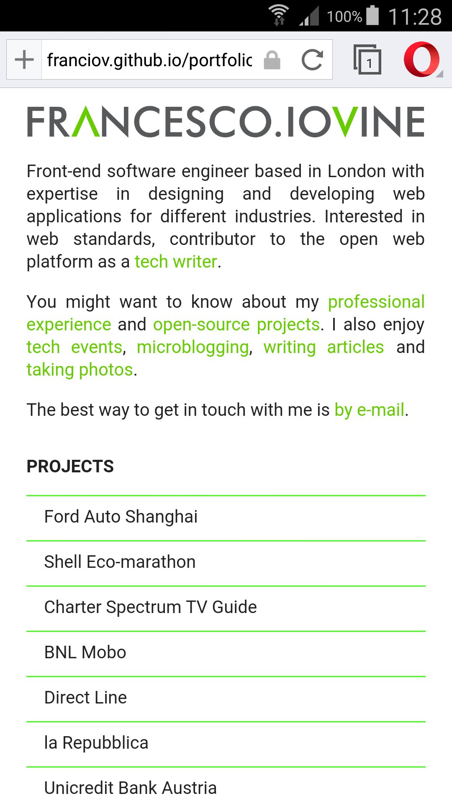
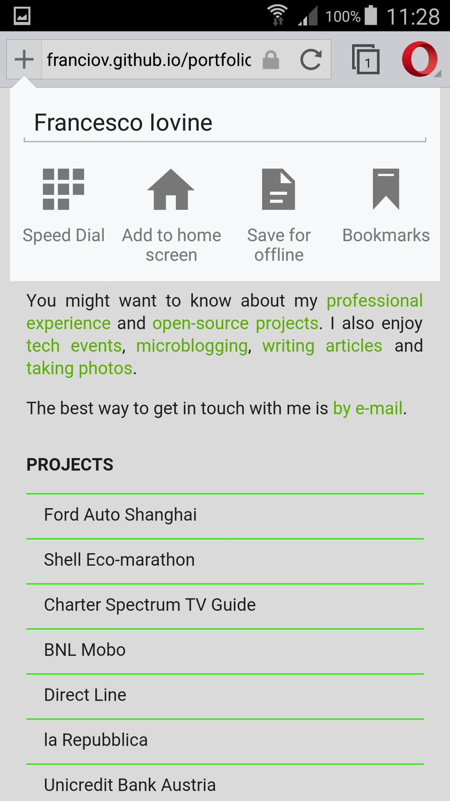
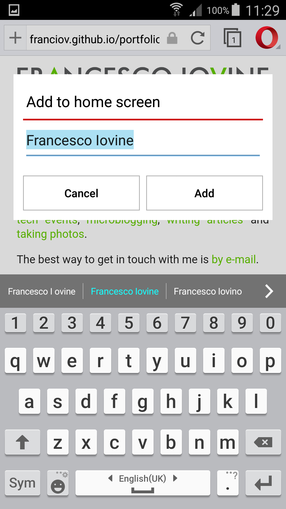
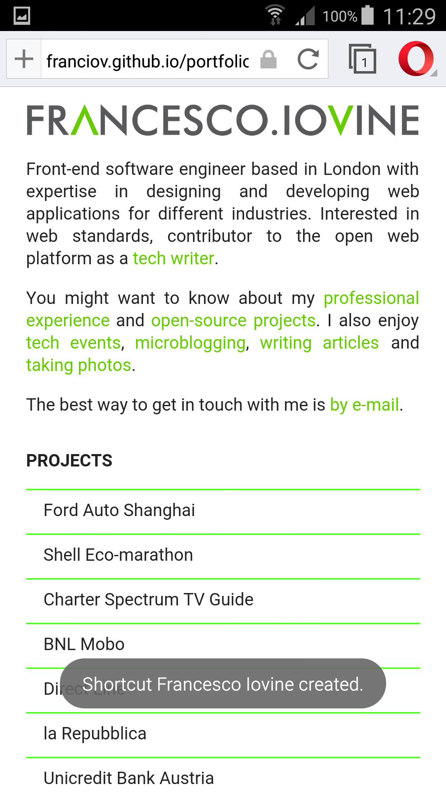
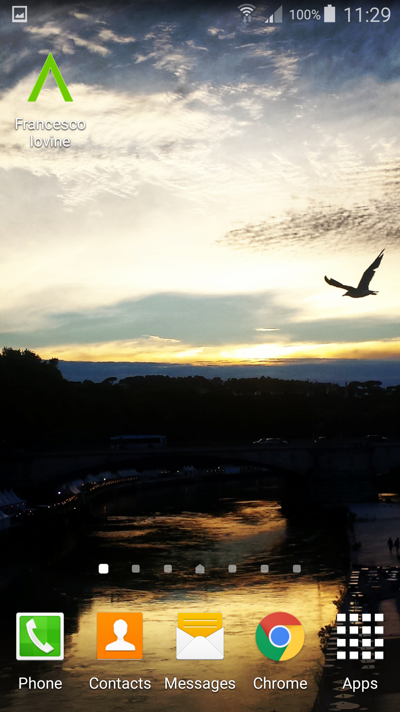
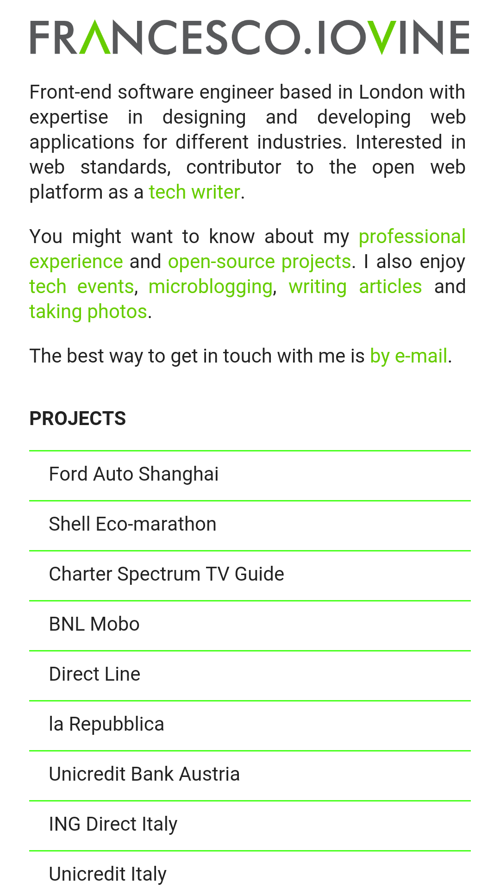
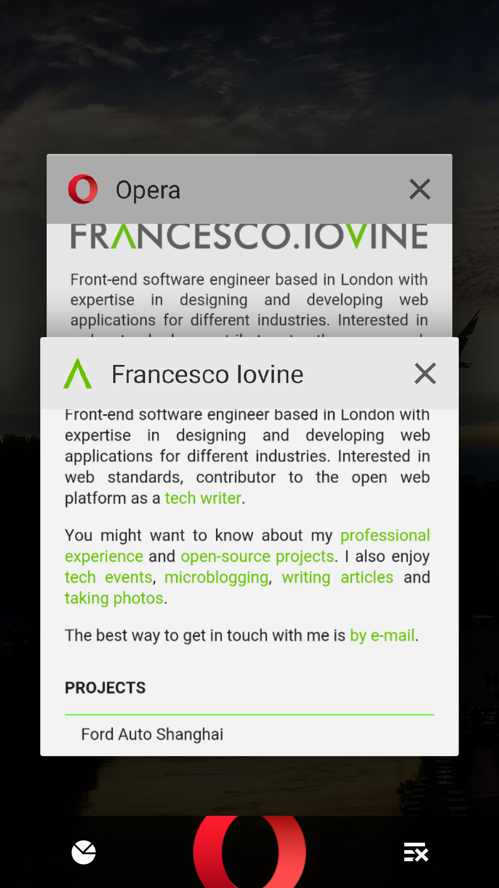
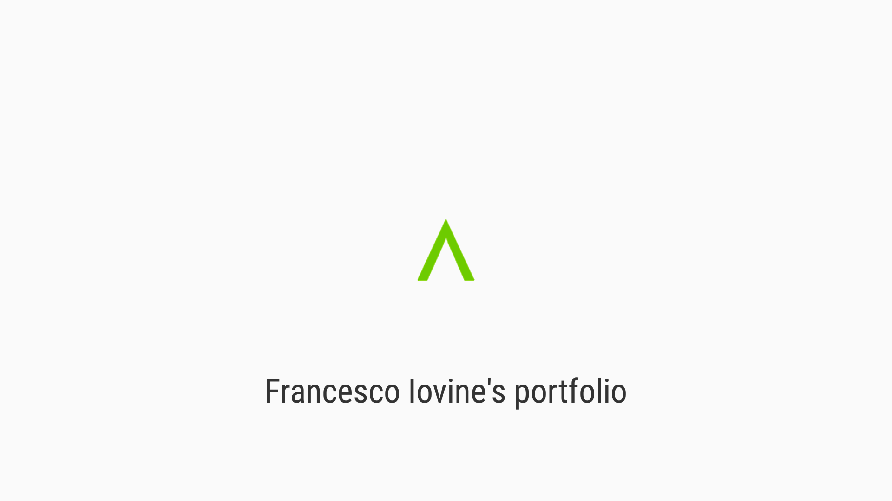
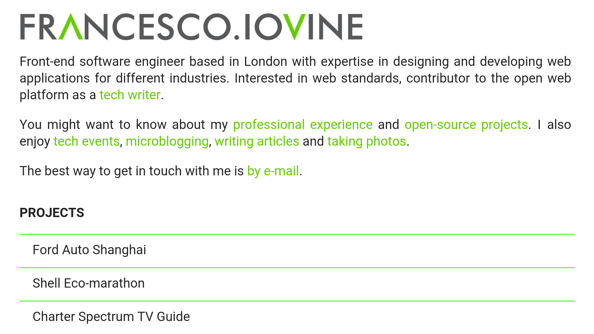

Installing a web app is a pretty old concept, but it’s been [standardised only recently](http://html5doctor.com/web-manifest-specification/). In this article I’m going to provide an overview of the different ways to install a web app, and explain why installable web apps plays a central role in the future of the Web Platform.

## History of installable web apps

Especially after the rise of mobile apps, most of the browser vendors understood that bookmarking couldn’t fulfil what users wanted on their mobile devices, so felt the necessity to provide Marketplaces and add icons to the Home Screen, in the same fashion of how Apple and then Google were making native apps discoverable and installable.

Sadly, every browser worked on its own solution.

### The Apple’s web-app-capable meta tag

Installing a web app was available in Safari for iOS since 2008, through the following [Apple-specific HTML meta tag](https://developer.apple.com/library/safari/documentation/AppleApplications/Reference/SafariHTMLRef/Articles/MetaTags.html) supported also by different vendors.

```html
<meta name="apple-mobile-web-app-capable" content="yes">
```

The *apple-mobile-web-app-capable* meta tag enables installing a web application on the home screen for Mobile Safari and all the browsers supporting it. It is possible to provide [different types of app icons](https://developer.apple.com/library/ios/documentation/AppleApplications/Reference/SafariWebContent/ConfiguringWebApplications/ConfiguringWebApplications.html) depending on the device resolution, a fullscreen experience, an image to use as splash screen (via HTML *link* elements), a way to check whether a web app has launched from the home screen via javascript (*window.navigator.standalone*), and even to set up the status bar style (through the *apple-mobile-web-app-status-bar-style* HTML meta tag). To help the user discover that the web page s/he is viewing is actually an installable web app, it is quite common to see a custom popup placed somewhere in the web describing what to do in order to add the application to the home screen.

### A JSON-based manifest comes from Google

Google followed the same approach until Chrome M39, when a [JSON-based manifest has been introduced](https://developer.chrome.com/multidevice/android/installtohomescreen).

> The manifest provides a way to wrap metadata about a web application into a single file. Using this metadata in conjunction with Add to Homescreen, you can create launch experiences more comparable to native applications.

### Packaged apps in Mozilla Firefox OS

Mozilla provides the possibility of adding shortcuts to the home screen from Firefox Mobile and to install [packaged apps](https://developer.mozilla.org/en-US/Marketplace/Options/Packaged_apps) in Firefox OS:

> A packaged app is a zip file that contains all the resources that enable an Open Web App to function, along with an app manifest in the zip’s root directory. The app manifest provides details about the app such as its description, icons used to identify the installed app and such. The package is then used to install the app to Firefox OS devices, Android devices and desktops. Once installed the app runs on the device, but is still able to access resources on the Web, such as a database on a Web server.

### Web App Manifest

The problem with all the approaches above is that they are different from each other, in other words *not standard*.

Opera has [recently announced](https://dev.opera.com/articles/installable-web-apps/) the possibility to add Web Apps to Home screen using the [Web App Manifest specification](https://w3c.github.io/manifest/):

> Through the magic of web standards, site owners can make this even better: by serving the site over HTTPS and providing some metadata in a manifest file a web app can get an optimized icon, and be run in "standalone" or even "fullscreen" mode, with a custom orientation. These web apps also run in a separate process, just like a native app. We call this "Installable Web Apps".

The Web App Manifest specification is [implemented also in Chrome](https://developers.google.com/web/updates/2014/11/Support-for-installable-web-apps-with-webapp-manifest-in-chrome-38-for-Android), and other browser vendors are working on this.

## Installable Web Apps

Making a web app installable is pretty simple: you basically need to add a JSON file into the app folder, and link it from HTML. The JSON file is the Web App Manifest in which you can set:

- the app name
- the icon
- the start page
- whether you want your app run full screen
- a fixed orientation
- and much more: read the [W3C specification](https://w3c.github.io/manifest/#manifest-and-its-members) for further details

### An example

As an example, I’ve recently made [my web site](https://franciov.github.io/portfolio) an installable web app. I decided to display my web site in fullscreen mode when installed, to load it with a landscape orientation, and to use a specific icon when added to the home screen and inside the splash screen.

To do so I initially configured my web manifest this way:

```json
{
  "name": "Francesco Iovine’s portfolio",
  "start_url": "index.html"
}
```

and linked it to the *index.html* adding this HTML link:

```html
<link rel="manifest" href="manifest.json">
```

Then I added an icon to be displayed on the Home Screen:

```json
{
  "name": "Francesco Iovine’s portfolio",
  "icons": [
  {
  "src": "layout/icons/144.transparent.icon.png",
  "sizes": "144x144",
  "type": "image/png"
  }
  ],
  "start_url": "index.html"
}
```

but the application name was too long so I added a short name:

```json
{
  "short_name": "Francesco Iovine",
  "name": "Francesco Iovine’s portfolio",
  "icons": [
  {
  "src": "layout/icons/144.transparent.icon.png",
  "sizes": "144x144",
  "type": "image/png"
  }
  ],
  "start_url": "index.html"
}
```

Here is how the installation process works using Opera 34:

<figure block="figure">
	
	
	
	
	
	
	<figcaption elem="caption">Installation process in Opera 34</figcaption>
</figure>

Notice that the *short_name* (not the extended application *name*), is displayed on the Home Screen.

Then I set the application to load in full screen:

```json
{
  "short_name": "Francesco Iovine",
  "name": "Francesco Iovine’s portfolio",
  "display": "fullscreen",
  "icons": [
  {
  "src": "layout/icons/144.transparent.icon.png",
  "sizes": "144x144",
  "type": "image/png"
  }
  ],
  "start_url": "index.html"
}
```

In fullscreen mode a splash screen is automatically displayed after tapping the icon on the Home Screen, and after that the web application gets its own windows (it does not run inside Opera).

<figure block="figure">
	
	
	
	<figcaption elem="caption">Running an installed web app in full screen</figcaption>
</figure>

Notice how the *short_name* is used in the Home Screen, while in the splash screen the extended application name is displayed together with the icon.

Finally, I set the application to load with a landscape orientation:

```json
{
  "short_name": "Francesco Iovine",
  "name": "Francesco Iovine’s portfolio",
  "display": "fullscreen",
  "orientation": "landscape",
  "icons": [
  {
  "src": "layout/icons/144.transparent.icon.png",
  "sizes": "144x144",
  "type": "image/png"
  }
  ],
  "start_url": "index.html"
}
```

With this web manifest my web site loads in full screen and landscape orientation.

<figure block="figure">
	
	
	<figcaption elem="caption">Running an installed web app in full screen and orientation landscape</figcaption>
</figure>

The screenshots are taken using Opera on an Android Samsung Galaxy S4, but you get the same behaviour using Chrome. The only difference between Opera and Chrome is that Opera requires the web application to be requested using a secure protocol (HTTPS) in order to enable the fullscreen and landscape features.

[Here](https://github.com/franciov/portfolio/commits/master/app/manifest.json) you can find the history of the web manifest file discussed above.

## What’s next

Installing web apps in a standard way is a very important step that enables a set of new features in the web platform. On the other hand, marketplaces do not seem to be successful on the Web.

### Pinned Apps

A new interesting concept in terms of *discoverability* comes from Mozilla, that at the end of 2014 introduced a new app model: [Pinned Apps](https://wiki.mozilla.org/Firefox_OS/Pinned_Apps).

*Pinning* means that it’s the browser itself that is used as a portal, a gateway, to discover apps:

> Users can discover web apps simply by searching or browsing the web, and use them instantly without needing to install them first.

A problem with installable web apps is in fact that they are not easily discoverable by browsing the web, so at the moment browser vendors are trying to offer marketplaces for Web Apps, providing a similar experience to how native apps are discovered. The concept of *Pinned Apps* tries to go beyond the marketplace, giving to the browser itself the power to discover apps.

### Progressive Apps

In 2015 Alex Russell (Google) listed the attributes of a *new* class of applications: [progressive apps](https://medium.com/@slightlylate/progressive-apps-escaping-tabs-without-losing-our-soul-3b93a8561955#.xx59riwcv).

> Every browser is likely to implement their own version of Progressive Apps. It’s a general pattern (like "AJAX"), not a specific implementation.

Progressive apps have to be *responsive*, *connectivity independent*, have *app-like-interactions*, have to be *fresh* (always up-to-date), *safe*, *discoverable*, *re-engageable*, *installable*, *linkable*. What makes all this possible is a set of old and new web technologies. What is new is a set of W3C specifications which are going to be available soon in the Web Platform: *W3C Manifest*, *Service Workers*, *Push notifications*. These new specs, when implemented and stable, will allow web developers to *install* web apps in a standard way, handle *offline* behaviour with more flexibility, and access to *push messages* sent from a server regardless of whether the app is loaded or in the foreground.

## Conclusions

In the last few years we have seen the Web Platform growing in terms of HTML, CSS and Javascript features and APIs that made possible to lots of libraries and frameworks to flourish. A number of new technologies is being standardised and implemented at a relatively fast pace, new interesting concepts are emerging, and the Web, due to its popularity, is rapidly reaching new devices, including TV, VR, AR and drones.

In this light, installable web apps can be seen as one of the milestones for the standardisation of a class of web applications that can compete with native technologies in the mobile world and beyond.
